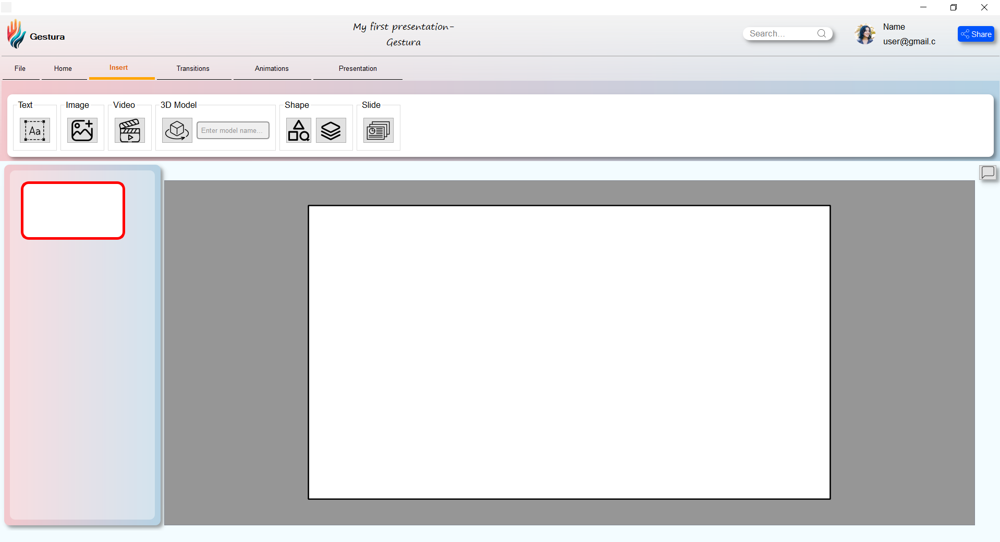
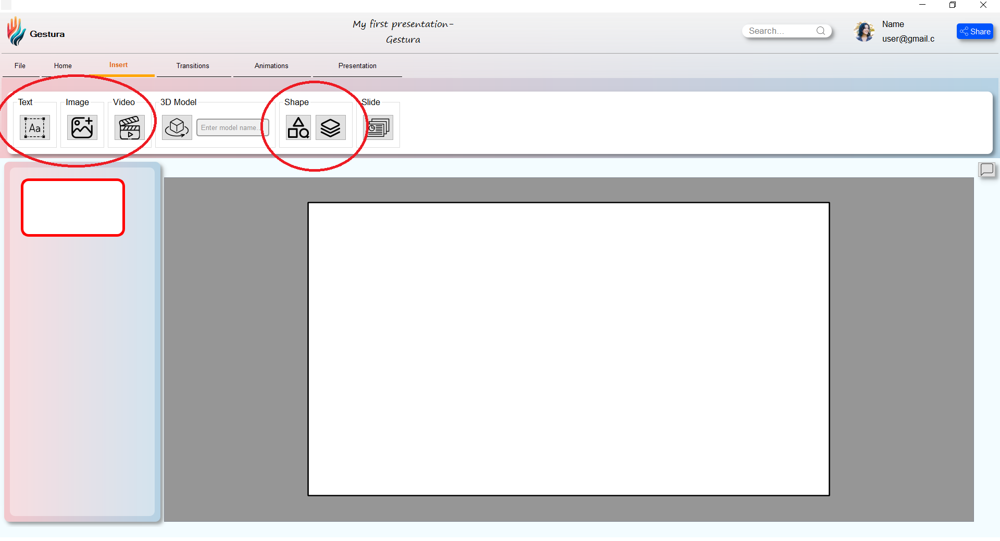
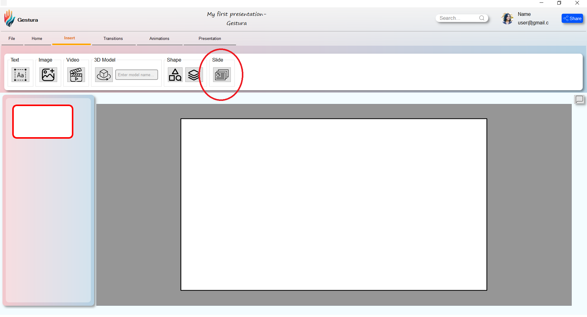
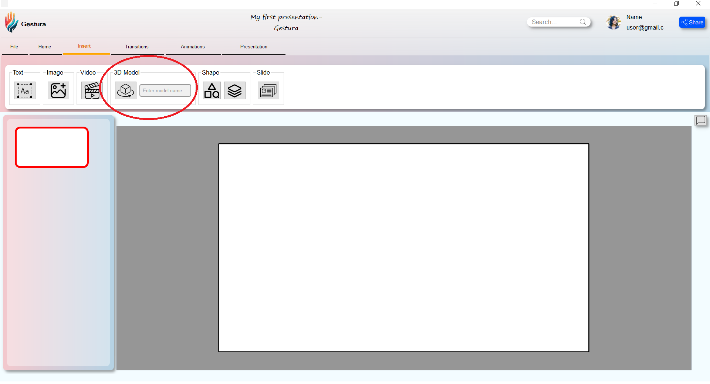
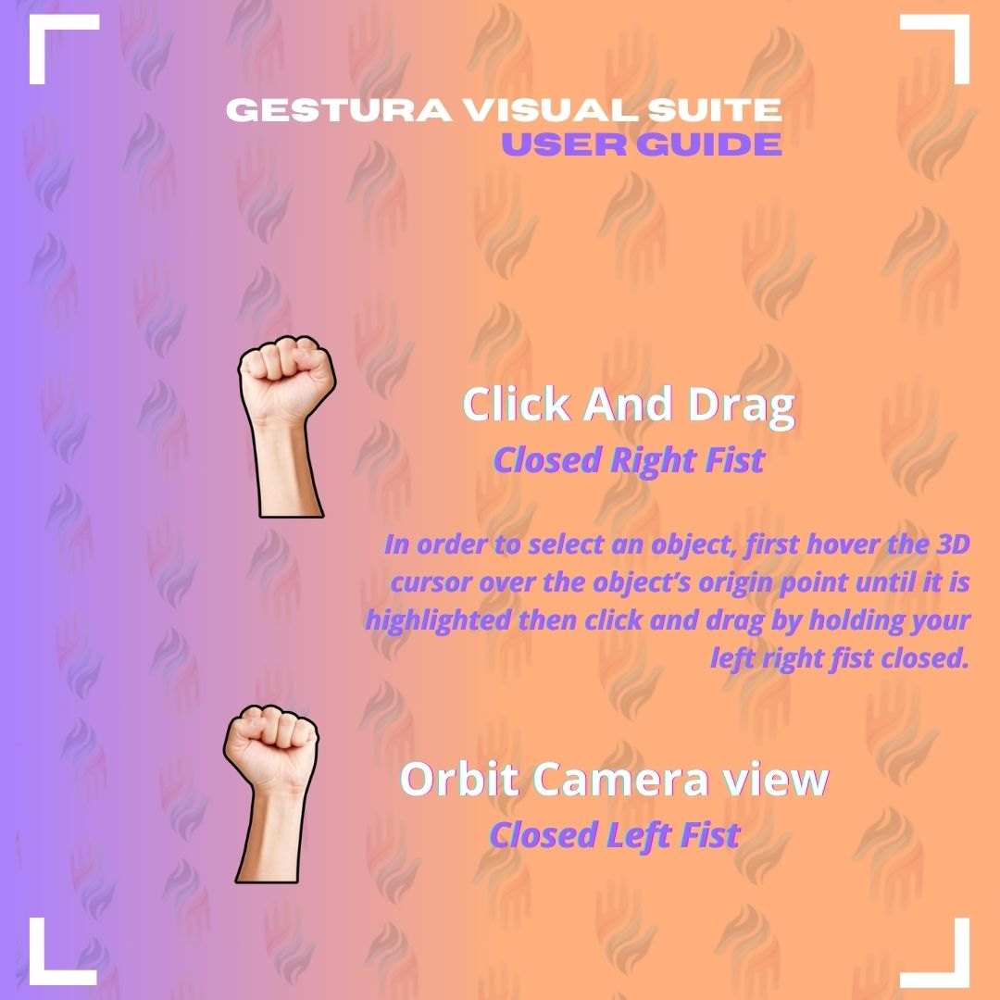
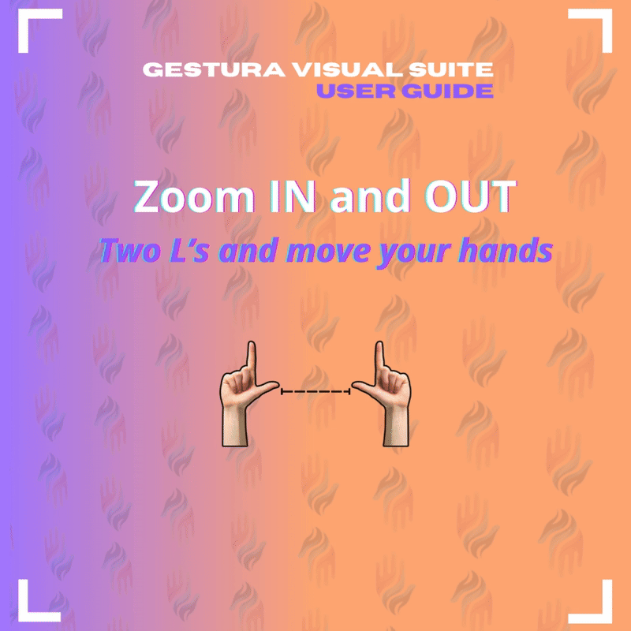
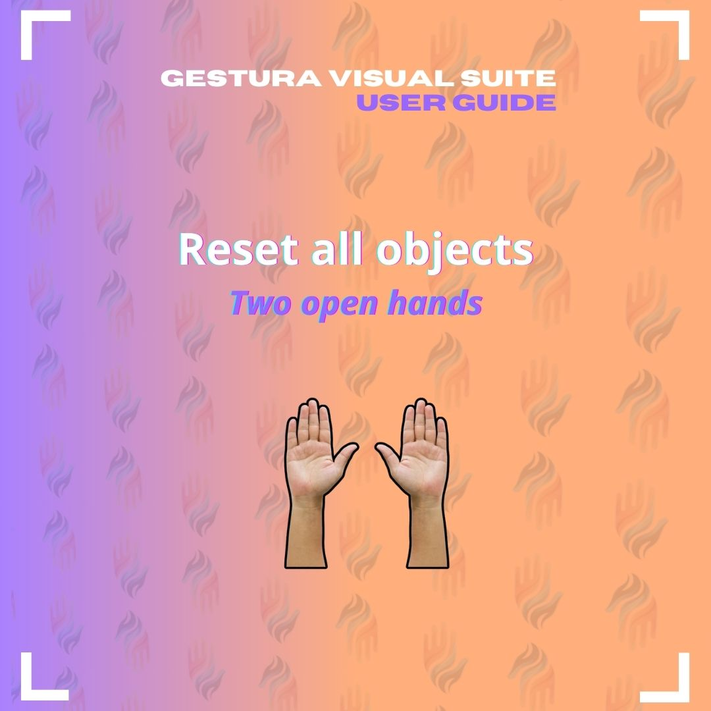

Gestura is a student project created by a group of Tunisia Polytechnic School Students. 

This project aims to implement 3D rendering into a basic slides-style presentation program with a seamless transition between classic 2D slides and realtime 3D scenes in order to allow for a better showcase of design prototypes, scientific maquettes or any other type of 3D objects. 

The project uses mediapipe hand tracking and gesture recognition based on point classification as its main 3D scenes input method in order to allow for an intuitive and smooth presentation without needing to resort to keyboard movement for showcasing said models. 

Tne 3D scene also comes equipped with navigation tools and visual feedback that's adapted to the absence of a conventional cursor.

The repository contains the following contents:
- main program (main.py)
- hand sign recognition model
- hand gestures data set for hand sign recognition along with a notebook for model training

# Authors:

**Zakaria M'hemed**: 3D Scenes & Interaction Systems, Camera Movement, Gesture Commands, Components Integration.  [Linkedin](https://www.linkedin.com/in/zakaria-mhemed-a29933217/)| [Github](https://github.com/ZakSwp)

**Hamden Brini**: User Interface Programming, User Interface Design, Components Integration, Tech Research. [Linkedin](https://www.linkedin.com/in/hamden-brini-42852b30b/)| [Github](https://github.com/hamdenBrini)

**Nacef Mbarek**: Gesture Detection & Recognition, Model Training, Gestures Dataset Collection. [Linkedin](https://www.linkedin.com/in/nacef-mbarek-151946291/)|[Github](https://github.com/nacef112)

**Omar Kammoun**: User Interface Design, [Linkedin](https://www.linkedin.com/in/omar-kammoun-903979295/).

# Requirements:

- Python 3.11 or later
- Mediapipe 0.8.1 or later
- OpenCV 3.4.2 or later
- Tensorflow 2.3.0 or later
- PyGame CE 2.6.0 or later
- PyQt5 5.15.11 or later
- Vtk
- Webcam for computer vision

- scikit-learn 0.23.2 or Later (If you want to log your own gestures)
- matplotlib 3.3.2 or Later (if you want to log your own gestures)

# Running the program:

In order to run the application simply run 'main.py'.
To create any asset head to the "Insert" tab.

You can add classic slides-style formatting (text, images, basic shapes, videos etc..)

In order to add 3D Models, create a new slide using the slide button

then add a 3D model using the 3D Model button.

This will take you to an explorer window where you can navigate to your 3D model. Currently Gestura only supports .obj files so make sure to have your model in that format, or use one of the 3D Models that ship with the repo in `\renderer\presentation assets`.

The Porsche 3D model is courtesy of **storque12** on [free3d](free3d.com). You can find it [here](https://free3d.com/3d-model/porsche-911-gt-43465.html).
After inserting the 3D model a prompt will ask you to add a texture for the model. Gestura currently supports one diffuse texture per object. You can link the model's necessary diffuse texture or you can cancel out of the prompt and keep the default white solid texture.

# Gestures Input Scheme:

For proper gesture recognition, remember to:
- Give only one command running at any given time (do not hold multiple fists).
- Stay within the frame range and avoid borders (the webcam window will display an alert of missing fingers if needed).
- Directly face the webcam when giving commands.

The input scheme is as follows:

# Project Files:

### main.py
The file that links all project components.
### app.py
The main file that contains interface behavior.
### rendererWithGestureInput.py
This component is for 3D rendering and gesture detection and processing.

# Third Party Resources:
The gesture detection and recognition system is based off of [hand-gesture-recognition-mediapipe repo](https://github.com/kinivi/hand-gesture-recognition-mediapipe/blob/main/README.md) by [kinivi](https://github.com/kinivi). Ours is a modified implementation with our own gestures data set and commands.

